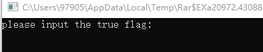
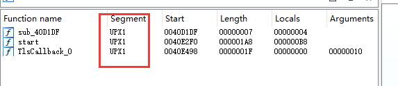
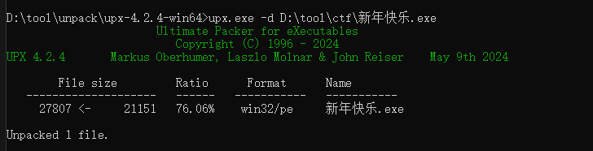
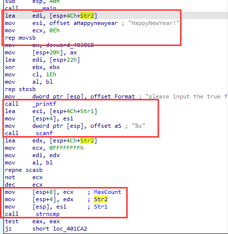

# WriteUp
题目链接：<https://buuoj.cn/challenges#%E6%96%B0%E5%B9%B4%E5%BF%AB%E4%B9%90>

解题时间：20240702-21:31

首先下载下来，点击运行，是一个字符串的程序。



用IDA直接打开，其明显是一个UPX壳



直接使用upx解壳软件，将其解开



再用IDA打开，定位到Main函数，其代码逻辑一目了然，两个字符串比较函数



```c
// 内存拷贝函数，将字符串拷贝到Str2中
lea     edi, [esp+4Ch+Str2]
mov     esi, offset aHappynewyear ; "HappyNewYear!"
mov     ecx, 0Eh
rep movsb

// 输入到Str1中
lea     esi, [esp+4Ch+Str1]
mov     [esp+4], esi
mov     dword ptr [esp], offset aS ; "%s"
call    _scanf

// 两个字符串进行比较
mov     [esp+8], ecx    ; MaxCount
mov     [esp+4], edx    ; Str2
mov     [esp], esi      ; Str1
call    _strncmp
```

最后很容易得到flag值为 `flag{HappyNewYear!}`

解题心得：
1. upx壳，通过IDA的Segment可以直接看到其壳名字；
2. 字符串拷贝函数，rep movsb，要明确。