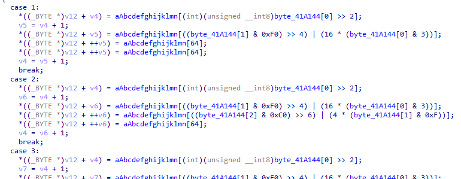

# WriteUp
题目链接：<https://buuoj.cn/challenges#reverse3>

解题时间：20240702-22:10

下载并打开该文件，其是一个很典型的加密函数。


我们一开始并不了解其编码形式，但是在观看加密函数过程中，其很明显有字符集特征。



通过询问chatgpt得知，这是base64编码形式。


现在整个流程清晰了，将flag输入用base64编码，然后经过一步相加算法，得到的结果与Str2进行比较。

我们现在对Str2进行逆运算，得到的结果在base64.decode，就得到最终的flag值了，算法如下：

```python
import base64
encryptedString = "e3nifIH9b_C@n@dH"
newString = ""
for index, char in enumerate(encryptedString):
    newString += chr(ord(char) - index)
decodedBytes  = base64.b64decode(newString)
print(decodedBytes.decode('utf-8'))
```

得到flag值是 `flag{i_l0ve_you}`

解题心得：
1. 对base64编码的特征要明显识别清楚。
2. 善于使用chatgpt，有时对你解题很有帮助。