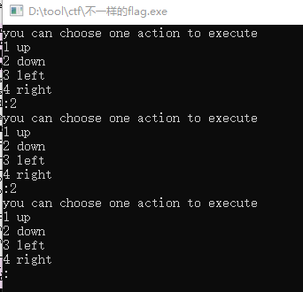
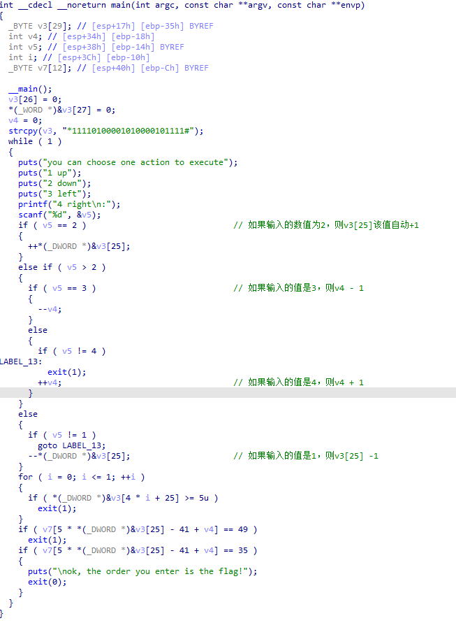
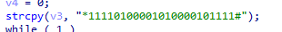
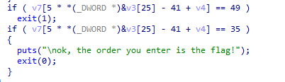
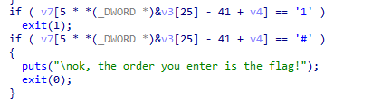

# WriteUp

题目链接：<https://buuoj.cn/challenges#%E4%B8%8D%E4%B8%80%E6%A0%B7%E7%9A%84flag>

解题时间：20240702-22:42

先打开程序，输入1-4，随机输入然后莫名退出



好吧，没啥头绪，使用IDA打开



看这代码有点莫名其妙，似乎是一个加密算法？ 开头一串字符表示啥意思，似乎没有啥（遍历）操作啊！！



然后一顿分析，输入1-4的值，其对应v3[25]和v4加减1，什么意思？

似乎输入错误，就会导致退出，但是最后这个什么鬼？49和35代表什么意思啊？



...... 分析了一大顿，崩溃，分析不出来

好吧，那就去找一下Writeup吧，看了一眼，恍然大悟..

原来是一道迷宫题！！！

解题的关键，就是把49和35转换为字符串



其`#`表示成功，`1`表示障碍，遇到障碍则退出（失败），结合 `*11110100001010000101111#`则明显是一个迷宫啊！！！

字符长度为25，则明显5*5的迷宫，输入1-4来控制上下左右走出这个迷宫

```
*1111
01000
01010
00010
1111#
```

走出来的顺序为 222441144222

则flag为`flag{222441144222}`

解题心得：
1. 遇到单个数字，记得转换为字符，来找找灵感；
2. 有迷宫题目，这种题目记得来解决一下！