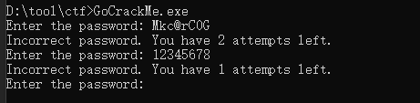
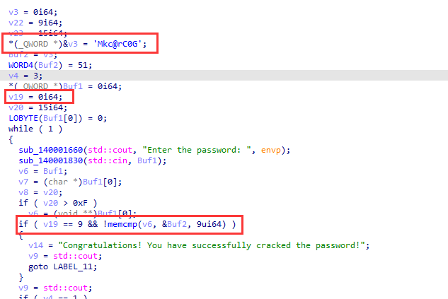
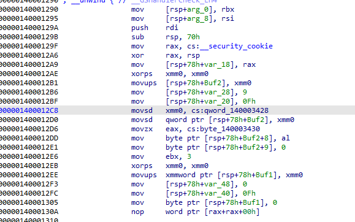
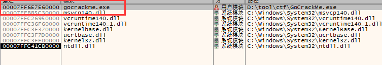
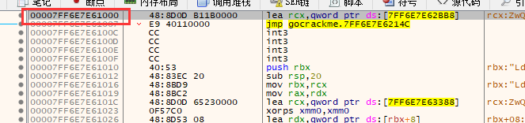
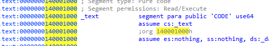
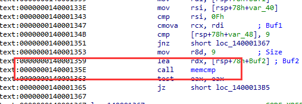
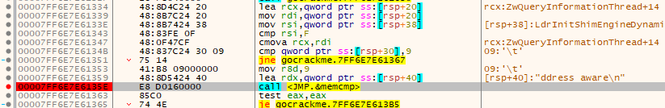
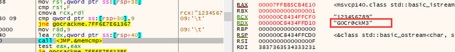
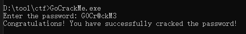

题目链接：<https://crackmes.one/crackme/6655839ae7b35c09bb266464>

解题时间：20240702-23:13

打开题目一看，一道很典型的密码输入题目



直接拖进IDA中，F5看看能不能有结果



其V3很明显一个`Mkc@rC0G`，但是这并不是密码，并且v19值似乎没有变动，没有看到明显的赋值语句。

看起汇编代码，到底对其做了什么运算。



好家伙，其一堆浮点寄存器的操作，分析这些要肯定GG了，我们改为动态调试，针对这条语句来动态调试。

```c
if ( v19 == 9 && !memcmp(v6, &Buf2, 9ui64) )
```

我们猜测v19是输入的字符串的长度，然后我们在memcmp处断下，来观察输入的值进行比较。

现在开始使用x64dbg进行定位



注意，这里一个小坑，00007FF6E7E60000 这个地址是基地址，但是点进去是从00007FF6E7E61000处开始为代码段的。



我们查看IDA的开始地址为 140001000



memcpy 这个函数在 14000135E处



很容易得到在x64dbg的偏移为 00007FF6E7E6135E处，CRTL+G 在这里下个断点，来移动到这里



输入123456789,确保9个字节，在这里断下，可以看到最终的答案 G0Cr@ckM3



再次输入密码，结果验证正确！



解题心得：
1. 学会IDA与X64dbg地址的对应关系查找
2. 算法太复杂的时候，学会动态去追

