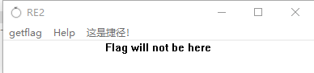
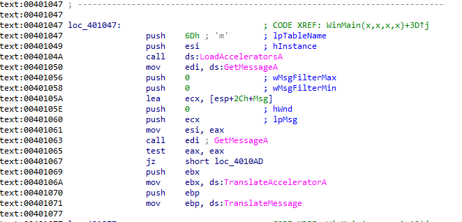
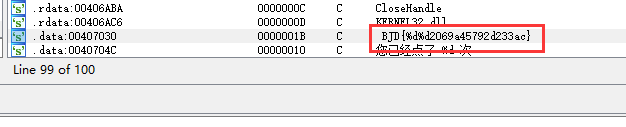
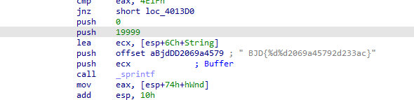

题目链接：<https://buuoj.cn/challenges#[BJDCTF2020]JustRE>

解题时间：20240703 - 0:07

打开这个程序，啥也没有，就是一个简单的程序框。

打开IDA，很典型的Windows窗口程序，这下比较难找了，没有突破口

打开字符串窗口，查看相关字符串，发现一个疑似Flag的东西

交叉索引，追进去，一目了然了！

很明显，Flag值为 `flag{1999902069a45792d233ac}`

解题心得：
1. IDA点击字符串时，如果跳转到hex窗口，关掉这个窗口，再次点击就是IDA View A了！
2. 这题思路自己也找对了，但是IDA窗口问题导致自己必须查看Writeup，很不应该！
