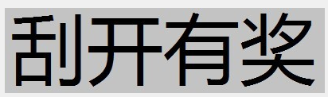
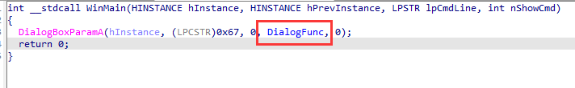
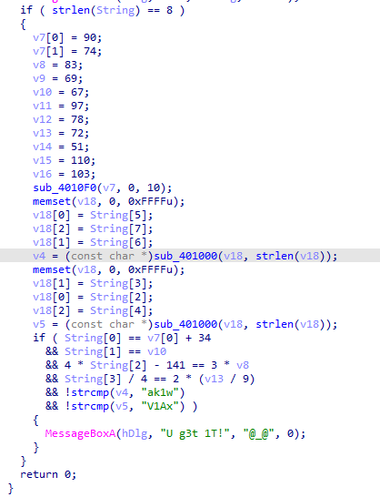
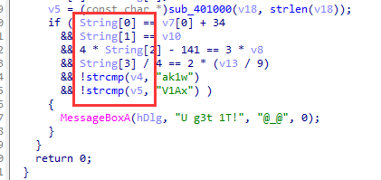
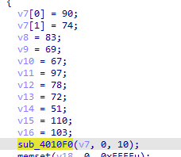
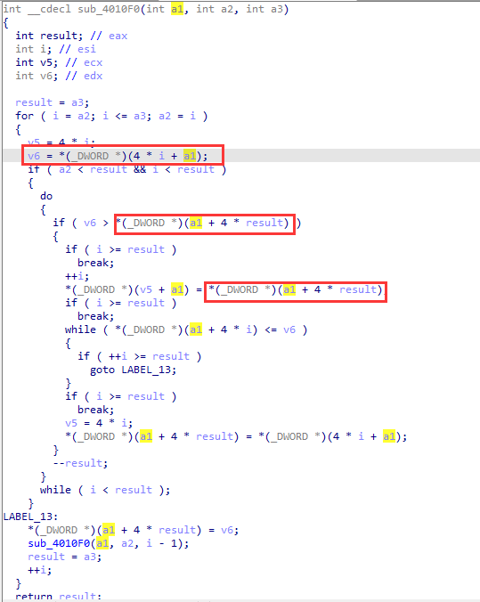
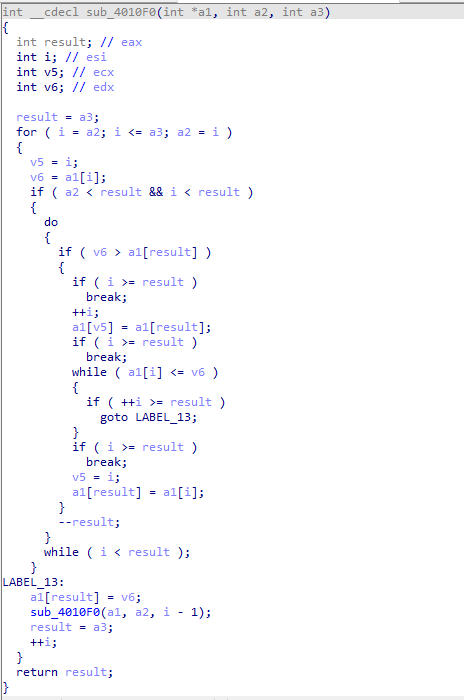
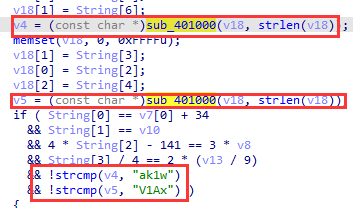
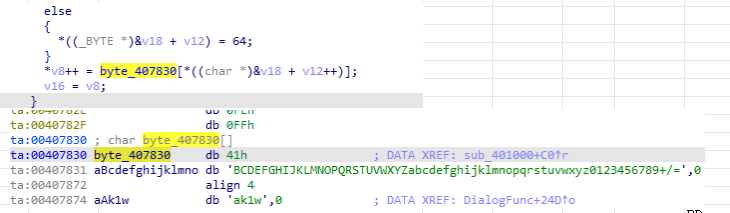
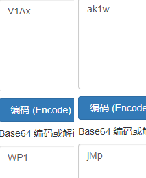

题目链接：<https://buuoj.cn/challenges#%E5%88%AE%E5%BC%80%E6%9C%89%E5%A5%96>

解题时间：20240703-0:56

先打开这个程序，出现这个界面，没什么鸟用 = = 



打开IDA，一个简简单单的对话框，里面有一个函数



点击去这个函数瞧瞧，似乎这就是答案



我们先关注最后面那地方，有个`you get it`，而上面是String和v4,v5拼接而成的。



我们有理由推测，Flag是这几个值拼接而成的（好吧，没有理由，因为自己看了题解，当时做的时候完全没有耐心去解决！！！！）

现在往上看第一个算法



直接进去这个函数，其反汇编代码如下



似乎我们有了C代码，我们能直接拿来跑吗？ 当然不行！！！

这里我们犯了一个巨大而且愚蠢的错误，F5代码这里定义明显有问题！！

问题很大！！ 其 `int a1` 明显定义错误，其还被强制转换为 `DWORD*`类型，而且 `i*4`，这明显就是 `int* a1`，一个`int`类型的数组啊，而不是单个值！！

这里明显传入的是一个int类型数组，然后再经过运算，将结果来进行输出！

好，知道这里定义有问题，我们按 Y 键，修改其定义！！！

如下，这样明显顺眼多了，我们直接运行其代码！



来编写C代码运行该函数

```c
// Ctf.cpp : 此文件包含 "main" 函数。程序执行将在此处开始并结束。
//

#include <iostream>
#include <Windows.h>
typedef DWORD _DWORD;
int __cdecl sub_4010F0(int* s, int a, int b)
{
    int result; // eax
    int i; // esi
    int v5; // ecx
    int v6; // edx

    result = b;
    for (i = a; i <= b; a = i)
    {
        v5 = i;
        v6 = s[i];
        if (a < result && i < result)
        {
            do
            {
                if (v6 > s[result])
                {
                    if (i >= result)
                        break;
                    ++i;
                    s[v5] = s[result];
                    if (i >= result)
                        break;
                    while (s[i] <= v6)
                    {
                        if (++i >= result)
                            goto LABEL_13;
                    }
                    if (i >= result)
                        break;
                    v5 = i;
                    s[result] = s[i];
                }
                --result;
            } while (i < result);
        }
    LABEL_13:
        s[result] = v6;
        sub_4010F0(s, a, i - 1);
        result = b;
        ++i;
    }
    return result;
}
int main()
{
    int arr[11] = { 'Z','J','S','E','C','a','N','H','3','n','g'};
    sub_4010F0(arr, 0, 10);
    for (auto i = 0; i <= 10; i++) {
        printf("%d ", arr[i]);
    }
}
```

得到结果，并且计算

```
51 67 69 72 74 78 83 90 97 103 110

计算可得
string[0] = v7[0] + 34 = 51 + 34 = 85 - U
string[1] = v10 = 74 - J
string[2] = (3*v8_69 + 141) / 4 = 87 - W
string[3] = 2 * (v13/9) * 4 = 80 - P
```

再看剩余的算法



很明显是base64特征的代码，则直接是base64加密算法，来进行解密即可



解密可得



拼起来，最后的Flag值为 `flag{UJWP1jMp}`!!

好吧，我也不知道为啥拼出来不是 `flag{UJWPWP1jMp}` ，看各个Writeup，也没有说明这一点，但不重要！！

解题心得：
1. 这题的关键是教会你IDA的反汇编并不是准确的，根据你的经验来重新构造定义，尤其是数组和指针的转化，这个要明确。