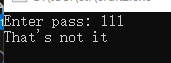
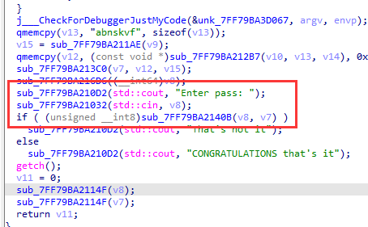
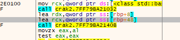
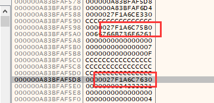
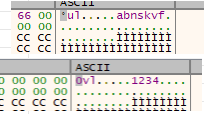
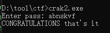

题目链接：<https://crackmes.one/crackme/663fa0746b8bd8ddfe33c780>

解题时间：20240703-2:07

打开窗口，很明显一个标准的输入窗口！

没啥好说的，拖到IDA里看看！

关键函数，比较V8和V7，V8明显是输入进来的，而V7应该就是密码了！

其经过一系列运算，我们直接采用动态调试的办法

直接查看其rbp中的数据结构

其明显是两个内存地址，点进去看一下

答案呼之欲出了！ abnskvf

解题心得：
1. 栈中的数据有时并不会解析，此时追进内存看一下。
