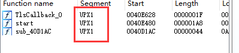
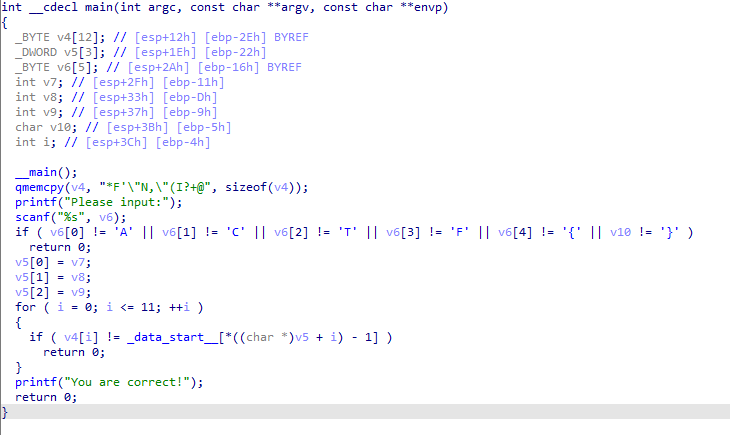
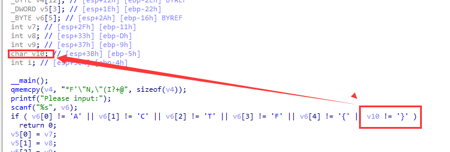
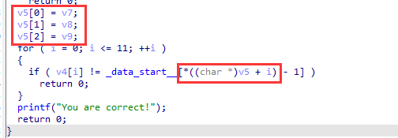
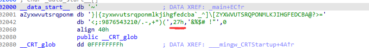
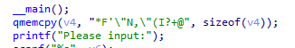

题目链接：<https://buuoj.cn/challenges#[ACTF%E6%96%B0%E7%94%9F%E8%B5%9B2020]easyre>

解题时间：20240703-14:23

打开程序，发现是一个upx壳



来直接开始脱壳，脱壳后的F5代码如下



注意，F5的代码很具有迷惑性，注意看这里，很明显是一个很长的字符串，包含v7 v8 v9 v10



再看变量v5，其明显是一个字符串数组，看到`*((char*)v5 + i))`的形式，即`v5[i]`



则`_data_start__`明显是一个字典



IDA字符转换有一个坑，27h这里是`'`，其IDA不能识别，怕与旁边的`'`混淆。

算法很明显了，从__data_start__中遍历中间输入的数据，然后与v4的进行比较



接下来编写算法，为了不让思路混乱，我们按照其原来的算法来编写自己的算法

```c
#include <Windows.h>
#include <iostream>

int main() {

	char __data_start__[] = "~}|{zyxwvutsrqponmlkjihgfedcba`_^]\\[ZYXWVUTSRQPONMLKJIHGFEDCBA@?>=<;:9876543210/.-,+*)('&%$# !\"";
	char v4[] = "*F'\"N,\"(I?+@";

	printf("%c", 0x27);

	//std::cout << strlen(__data_start__);

	for (int i = 0; i < 12; i++) {
		char ch = v4[i];
		for (int j = 0; j < strlen(__data_start__); j++) {
			if (ch == __data_start__[j]) {
				printf("%c", j + 1);
				break;
			}
		}
	}

	return 0;
}
```

这里还有一个坑，IDA粘贴过来的字符数据要进行修正，不要硬往上搬！

最后很容易解得 `flag{'U9X_1S_W6@T?}`

解题心得：
1. IDA中粘贴的字符串一定要粘贴准确；
2. 识别F5代码，其变量特征一定要清楚，不要搞混了。