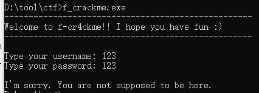
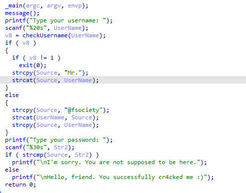
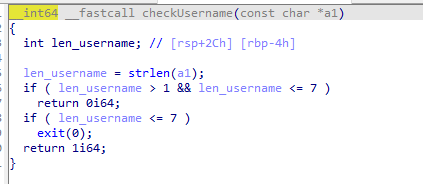
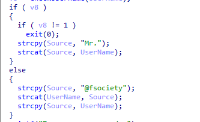
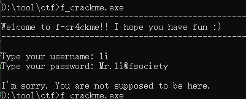
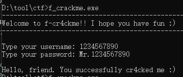

题目链接：<https://crackmes.one/crackme/6182052d33c5d4329c345484>

解题时间：20240703-22:47

打开文件，一个标准的Crackme

然后用IDA打开

标准的字符串拼接函数，查看checkUsername

明显两种，1-7，返回0， 大于7 ，返回1

现在回来继续看下面的代码

算法很明显了，不过多介绍了

第一种解法：

第二种解法：

这题比较水，又划了一套题！！