题目链接：<https://buuoj.cn/challenges#CrackRTF>

解题时间：20240703-23:56

打开这个，一个标准的输入密码题目

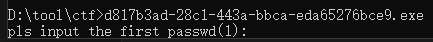

用IDA打开这个程序，似乎要输入两次密码

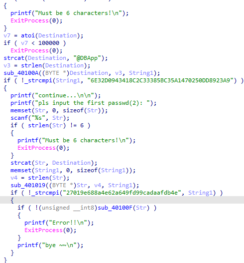

我们看第一个密码相关的，输入进去后有一个atoi，还必须 >= 100000

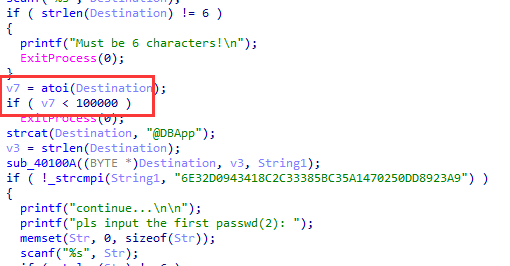

进处理函数看看

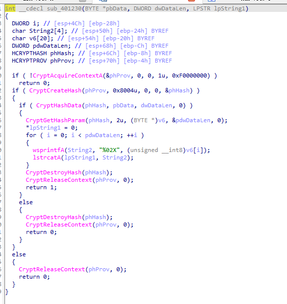

是个哈希值运算的，因为我们范围已经规定好了 [100000,1000000)

直接字段爆破即可，代码如下

```c++
#include <Windows.h>
#include <iostream>

int __cdecl sub_401230(BYTE* pbData, DWORD dwDataLen, LPSTR lpString1)
{
    DWORD i; // [esp+4Ch] [ebp-28h]
    CHAR String2[4]; // [esp+50h] [ebp-24h] BYREF
    BYTE v6[20]; // [esp+54h] [ebp-20h] BYREF
    DWORD pdwDataLen; // [esp+68h] [ebp-Ch] BYREF
    HCRYPTHASH phHash; // [esp+6Ch] [ebp-8h] BYREF
    HCRYPTPROV phProv; // [esp+70h] [ebp-4h] BYREF

    if (!CryptAcquireContextA(&phProv, 0, 0, 1u, 0xF0000000))
        return 0;
    if (CryptCreateHash(phProv, 0x8004u, 0, 0, &phHash))
    {
        if (CryptHashData(phHash, pbData, dwDataLen, 0))
        {
            CryptGetHashParam(phHash, 2u, v6, &pdwDataLen, 0);
            *lpString1 = 0;
            for (i = 0; i < pdwDataLen; ++i)
            {
                wsprintfA(String2, "%02X", v6[i]);
                lstrcatA(lpString1, String2);
            }
            CryptDestroyHash(phHash);
            CryptReleaseContext(phProv, 0);
            return 1;
        }
        else
        {
            CryptDestroyHash(phHash);
            CryptReleaseContext(phProv, 0);
            return 0;
        }
    }
    else
    {
        CryptReleaseContext(phProv, 0);
        return 0;
    }
}

int main() {
    char firstPassword[260];
    char String1[260];
    printf("Hello World!\n");
    for (int i = 100000; i < 1000000; i++) {

        sprintf_s(firstPassword, "%d", i);
        strcat_s(firstPassword, "@DBApp");
        auto v3 = strlen(firstPassword);
        sub_401230((BYTE*)firstPassword, v3, String1);
        if (strcmp(String1, "6E32D0943418C2C33385BC35A1470250DD8923A9") == 0) {
                            
            printf("%s", firstPassword);
        } 
    }

	return 0;
}
```

得到密码 123321，这个很简单，我们继续看第二个密码

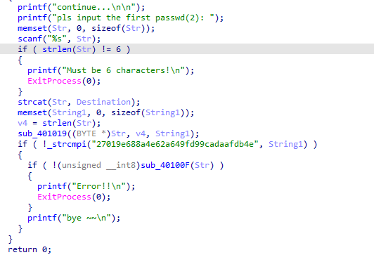

这个因为没有 atoi的验证，似乎有点棘手，不太好做.. 用老办法爆破爆破失败...

抓狂ing ...

但是看后面，发现还有一个函数，点进去看看

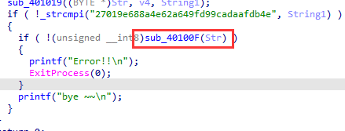

发现该对资源进行操作

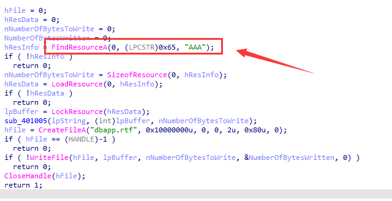

我们用CFF explorer工具打开这个资源

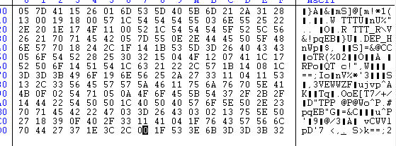

好吧，没找到有用的信息，我们继续往上那个资源操作下面一个函数

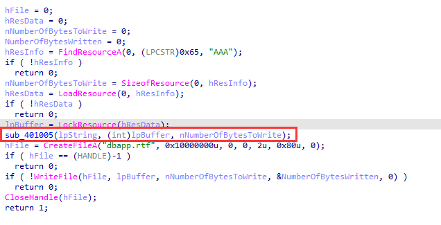

点进去看一下，是一个异或操作

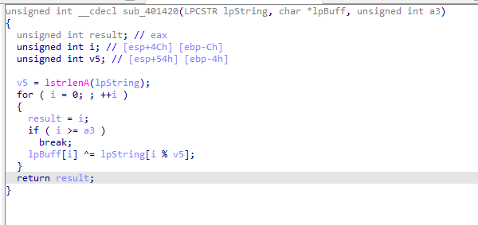

啊啊啊啊啊！！！！还是没有思路啊，但是整个流程大体弄明白了。

简单来说，将输入进去的密码和资源"AAA"进行 异或操作，然后结果放在dbapp.rtf 的文件中！！

但是，怎么得到密码还是没思路，爆破不行！！！

好吧，我投降！！去看一下别人的Writeup吧！！

瞥了几眼....

明白了！！！答案在 dbapp.rtf 文件里

rtf类型的文件有一个固定的头文件字符，就像PE一样，然后 ^ 可以进行逆运算

我们只需要利用前6个字节，就可以知道密码。

而.rtf正好就有六个字节

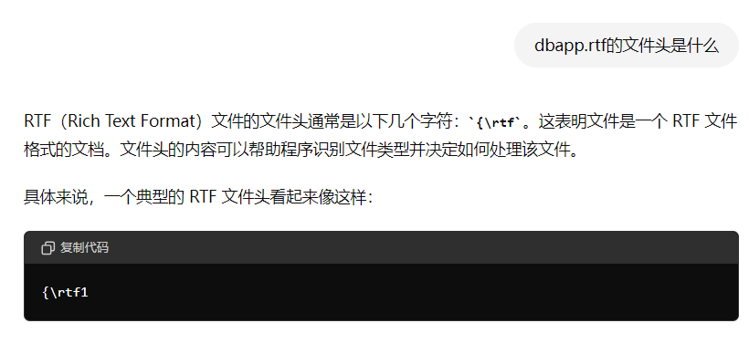

我们再拿去AAA前六个字节的数据，将其进行 ^ 运算

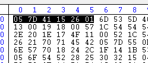

代码如下

```
int main() {

    BYTE lpBuff[] = { 0x05,0x7D,0x41,0x15,0x26,0x01 };

    BYTE result[] = { '{', '\\','r','t','f','1' };

    for (int i = 0; i < 6; i++) {
        printf("%c", result[i] ^ lpBuff[i]);
    }


    return 0;
```

得到第二个密码是 ~!3a@0

两个密码输入进去，得到一个.rtf文件

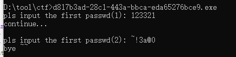

从这个文件中就可以得到flag值了

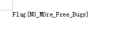

Flag{N0_M0re_Free_Bugs}

解题心得：
1. ^ 是可逆运算；
2. 资源加载的情况你应该了解；
3. 如果遇到文件类型，记得看其头文件。
