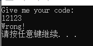
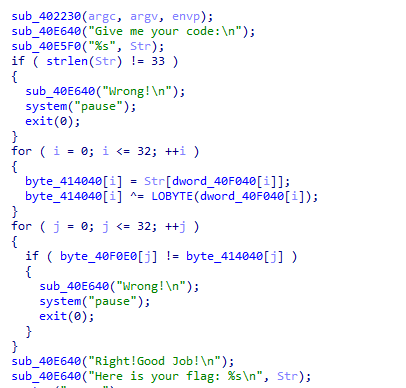

题目链接：<https://buuoj.cn/challenges#[MRCTF2020]Transform>

解题时间：20240704 - 1:21

打开，输入一个code值



用IDA来看汇编代码



是一个标准算法逆向题

这个题很简单，关键是下面这一行 

` byte_414040[i] = Str[dword_40F040[i]];`

这里解密要用到双循环， 第一层计算出 i = 0 时，

然后配对，看看 dword_40f040[j] == i，然后求出 byte_414040[j] = Str[i]

最后就是求解出相关代码，，这种顺序要了解，看到这类题直接想到这种模板

下面直接写出解答算法，其实整个题一点都不难，就是那一步比较绕

```
#include <Windows.h>
#include <iostream>
using namespace std;
int main() {

	BYTE dword_40F040[] = { 9, 0x0A, 0x0F, 0x17, 7, 0x18, 0x0C, 6, 1, 0x10, 3, 0x11, 0x20 , 0x1D, 0x0B, 0x1E, 0x1B, 0x16, 4, 0x0D, 0x13, 0x14, 0x15, 2, 0x19, 5, 0x1F, 8, 0x12, 0x1A, 0x1C, 0x0E, 0,0 };
	
	BYTE ans[] = { 0x67, 0x79, 0x7B, 0x7F, 0x75, 0x2B, 0x3C, 0x52, 0x53, 0x79, 0x57, 0x5E, 0x5D, 0x42, 0x7B, 0x2D, 0x2A, 0x66, 0x42, 0x7E, 0x4C, 0x57, 0x79, 0x41, 0x6B, 0x7E, 0x65, 0x3C, 0x5C, 0x45, 0x6F, 0x62, 0x4D,0x3F };

	BYTE tmp1[34];

	BYTE Str[33];

	for (auto i = 0; i < 34; i++) {
		tmp1[i] = ans[i] ^ dword_40F040[i];
	}
	
	for (auto i = 0; i <= 32; i++) {
		for (int j = 0; j <= 32; j++) {
			if (dword_40F040[j] == i) {
				Str[i] = tmp1[j];
				break;
			}
		}
	}

	for (auto i = 0; i <= 32; i++) {
		printf("%c", Str[i]);
	}
}
```