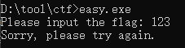
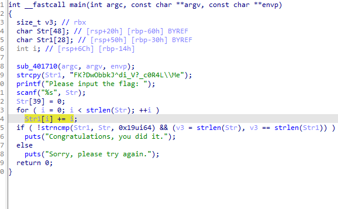

题目链接：<https://crackmes.one/crackme/6162e50333c5d4329c34509c>

解题时间：20240704 - 1:57



用IDA打开反汇编之后，思路很明显



直接写算法吧

```
#include <Windows.h>
#include <iostream>
using namespace std;
int main() {

	char Str1[28];
	strcpy_s(Str1, "FK?DwObbkJ^di_V?_c0R4L\\Me");
	
	for (auto i = 0; i < strlen(Str1); i++) {
		Str1[i] += i;
	}

	printf("%s", Str1);
}
```

哎，又水了一题

解题心得：
1. IDA中的字符串，`//` 人家自动给你标注好了，不用你去添加了，但是小心字符
