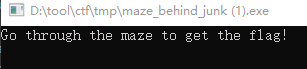
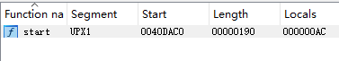
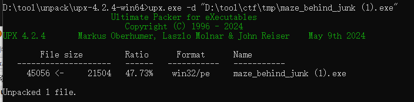
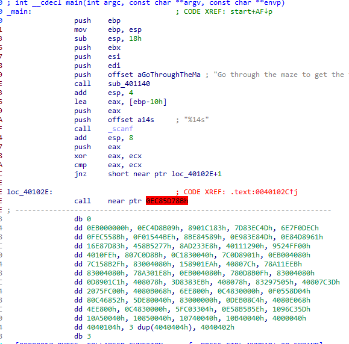
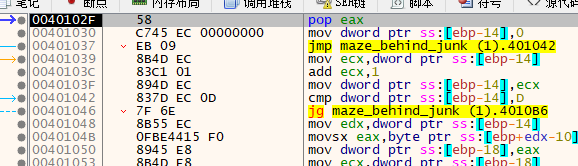
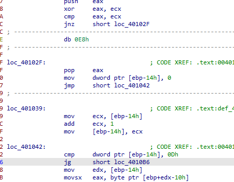
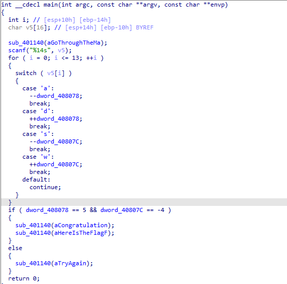
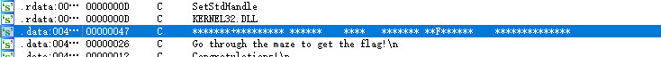
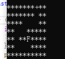

题目链接：<https://buuoj.cn/challenges#[HDCTF2019]Maze>

解题时间：20240705 - 20:52

打开题目，常规的输入题



打开ida，发现是upx壳



直接用upx工具脱壳



然后用ida打开



什么鬼东西，肯定存在花指令

拖入x32dbg中运行，运行到花指令附近



对比上面 2E，这个偏移有一个花指令

调整之后的花指令如下图所示



这里有一个小技巧，调整完花指令之后，没法按F5生成

先把补丁打上去，NOP，然后重新打开，再按F5就出来了

。。。。当时不会用这个技巧，直接逆出了算法 

```c
#include <iostream>

int main(){
    
    int asc_408078 = 7;
    int dword_40807C = 0;
    char Str[] = "123456";

    // 0 - 0
    // 1 - 3
    // 2 - 18
    // 3 - 22 * 不能到达
    char byte_401112[] = {0,4,4,1,4,4,4,4,4,4,4,4,4,4,4,4,4,4,2,4,4,4,3}; // 23
    for(int i = 0 ; i <= 1;i++){
        int x = Str[i] - 'a';
        if(x > 22){
            continue;
        }

        switch(byte_401112[x]){
            case 0: //loc_401096
            asc_408078 -= 1;    // a 
            break;
            case 1: //loc_4010A5
            asc_408078 += 1;    // d
            break;
            case 2: // loc_401085
            dword_40807C -= 1; // s 
            break;
            case 3: // loc_401074 // w
            dword_40807C =+ 1;
            break;
        }
    }

    if(asc_408078 == 5 && dword_40807C == -4){
        // congruation
    }


}

// ssaaasaassdddw
```

对比一下，其实比较的挺准的



这明显是一道迷宫题，一个x，一个y值，来走迷宫

迷宫在哪里呢？？？ 没找到啊！！！

好吧，看Writeup吧，真拿这题没辙了。。

好吧，藏在字符串里



直接一个 7*10 长度的字符串



直接 ssaaasaassdddw，走完

flag值就是 flag{ssaaasaassdddw}

其实感觉这道题还有别的解法，这个迷宫太突兀了！！！

解题心得：
1. 了解patch的方法，打完patch，重新打开就可以F5了！