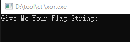

题目链接：<https://buuoj.cn/challenges#[HDCTF2019]Maze>

解题时间：20240705 - 21:42

打开，又是一个简单的字符串输入题目



打开IDA，F5失败，似乎是个函数调用失败


不影响，看函数分析吧

这个函数很小，直接列出分析结果


有花指令，但不影响结果

另外以后要知道其`lea ecx, [edx+1]` 这种计算字符串长度的策略

总体很简单，就是一个异或运算，算法如下：

```c++
#include <Windows.h>
#include <iostream>
using namespace std;
int main() {

	// MSAWB~FXZ:J:`tQJ"N@ bpdd}8g
	const char s[] = "MSAWB~FXZ:J:`tQJ\"N@ bpdd}8g";
	for (auto i = 0; i < strlen(s); i++) {
		printf("%c", i ^ s[i]);
	}
}
```

运算出的结果 MRCTF{@_R3@1ly_E2_R3verse!}