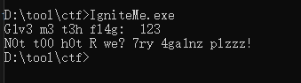
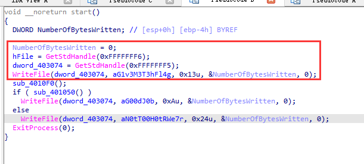
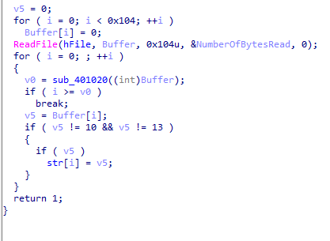
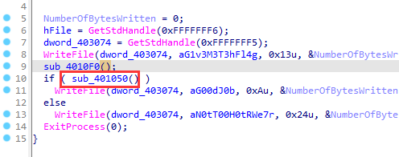
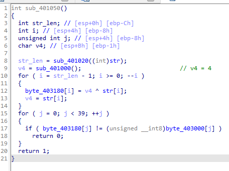
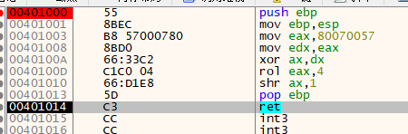

题目链接：<https://buuoj.cn/challenges#[HDCTF2019]Maze>

解题时间：20240705 - 22:39

一个简单的输入字符的题



用IDA打开看一下

似乎用WriteFile来代替Printf的输出


点进 sub_4010F0 函数看一下



ReadFile就是输入，sub_401020是求字符串长度的

该函数就是把输入的内容拷贝到Str这个全局变量中，跳过10/13换行回车符号

下面就是关键的判断函数了



点击去看函数，整体是来进行一个^运算，然后和一个结果进行比较



sub_401000的值是很复杂的运算，我们使用x32dbg动态追一下



最后追出来的结果是 v4 = 4 ..


下面来还原算法，关键这算法，如何还原回来

```c
for ( i = str_len - 1; i >= 0; --i )
{
    byte_403180[i] = v4 ^ str[i];
    v4 = str[i];
}
```

首先，其整体是个从后往前的，我们逆算法也是从后往前，整体是

```c
v4 = 4
for ( i = str_len - 1; i >= 0; --i )
{
    Str[i] = v4 ^ encoded[i];
    v4 = ???;
}
```

这里自己当时做的时候，遇到了一个坑，就是`v4`到底是`Str[i]`还是`encoded[i]`呢？

很明显，我们要求的是`Str[i]`，而运算到`v4`时该项值`Str[i]`值已经运算出来了。

进行在下一步运算，要用`Str[i+1]`的值，因此这次时`Str[i]`

这个坑一定要绕过来，当时就是这点没计算好，导致做错。

```c
#include <Windows.h>
#include <iostream>
using namespace std;
int main() {

    byte v4 = 4;

    unsigned char byte_array[] = {
        0x0D, 0x26, 0x49, 0x45, 0x2A, 0x17, 0x78, 0x44, 0x2B, 0x6C, 0x5D,
        0x5E, 0x45, 0x12, 0x2F, 0x17, 0x2B, 0x44, 0x6F, 0x6E, 0x56, 0x09,
        0x5F, 0x45, 0x47, 0x73, 0x26, 0x0A, 0x0D, 0x13, 0x17, 0x48, 0x42,
        0x01, 0x40, 0x4D, 0x0C, 0x02, 0x69, 0x00
    };

    unsigned char ans[40];
    memset(ans, 0, 40);

    for (int i = 38; i >= 0; i--) {
        ans[i] = v4 ^ byte_array[i];
        v4 = ans[i];
    }

    printf("%s", ans);
}
```

最后的flag值为 `R_y0u_H0t_3n0ugH_t0_1gn1t3@flare-on.com`

