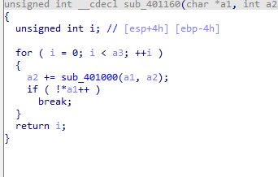

题目链接：<https://buuoj.cn/challenges#[FlareOn6]Overlong>

解题时间：20240706 23:35 

打开看一下这个程序

用IDA来打开该程序

就一个sub_401160函数，进行一系列运算

动态运算，追了一下，没发现有什么线索...

继续看了一会，好吧，实在看不出来了....

去找找别人的writeup了。

好好好，明白了，问题出在 byte_402008 这个BYTE数组中

传入0x1ch，但是其长度是0xaf

解决办法就是将0x1c改为0xaf，然后进该函数运算

就能运算出正确的结果了

flag值为`flag{I_a_M_t_h_e_e_n_C_o_D_i_n_g@flare-on.com}`

这题长度这一块，自己没能很好的把握，很不应该..