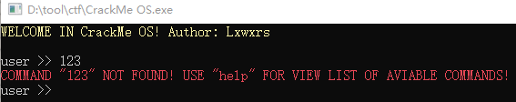
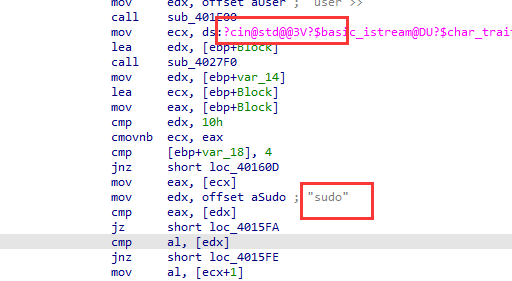
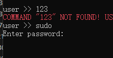
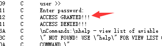
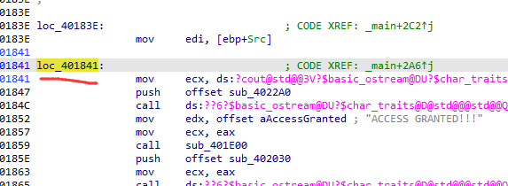
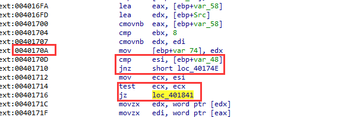
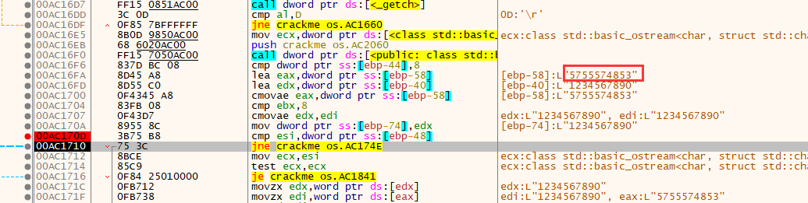
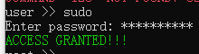

题目链接：<https://crackmes.one/crackme/6648f35e6b8bd8ddfe33cc00>

解题时间：20240706 - 23:52

这题一开始没看出来，最后好兄弟动态追一下，知道答案了

打开程序，是个输入程序

打开IDA，代码比较长，但通过cin这里，判断第一个为输入sudo

确认一下，果然是输入sudo

下面就是输入密码了

代码太长了，我们直接从字符串入手，找到成功的字符串

直接看其跳转逻辑

跳转判断如下

直接用x32dbg追下去查看

密码就是 5755574853

验证一下，验证成功

这题很简单，密码都是明文，但当时做的时候太粗心，没有足够的耐心！
