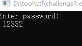
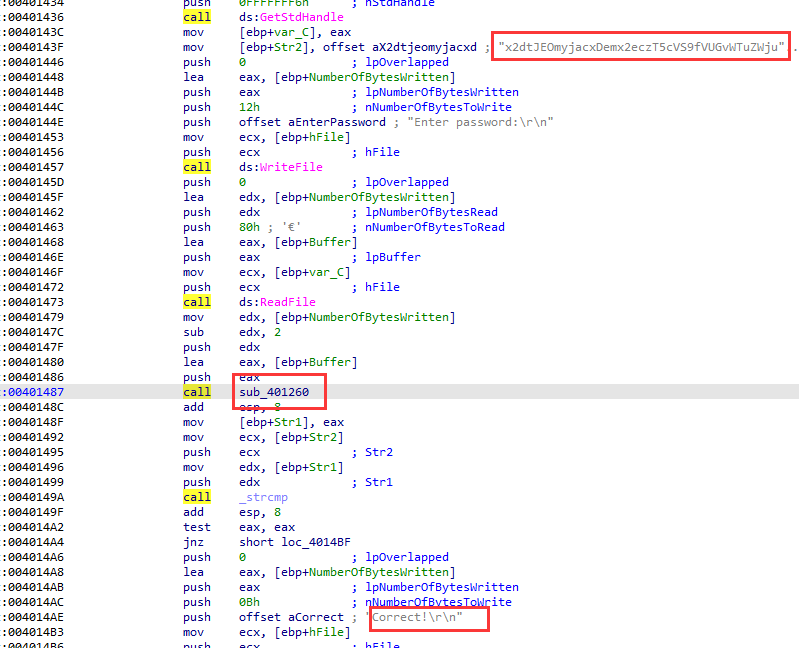
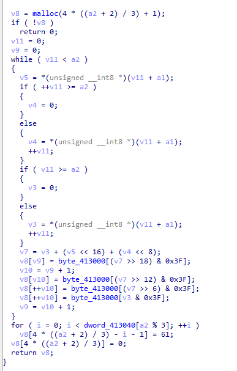
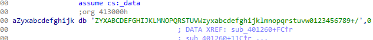

题目链接：<https://buuoj.cn/challenges#[FlareOn3]Challenge1>

解题时间：20240707 0:19

打开，输入密码



用IDA打开，其逻辑已经很明显了，输入一个字符串，然后进行加密，最后与结果进行比较



但是说实话，这个加密函数我看不懂.... 没做过这样的题目



灰溜溜地去看writeup题解了

最后发现，是base64编码表，而且编码表被改变了



最后的解码代码如下

```python
import base64
import string
str1 = "x2dtJEOmyjacxDemx2eczT5cVS9fVUGvWTuZWjuexjRqy24rV29q"
string1 = "ZYXABCDEFGHIJKLMNOPQRSTUVWzyxabcdefghijklmnopqrstuvw0123456789+/"
string2 = "ABCDEFGHIJKLMNOPQRSTUVWXYZabcdefghijklmnopqrstuvwxyz0123456789+/"
print(base64.b64decode(str1.translate(str.maketrans(string1, string2))))
```

最后的flag值为 `flag{sh00ting_phish_in_a_barrel@flare-on.com}`

我们之后要看到base64编码的东西要记住，很简单


