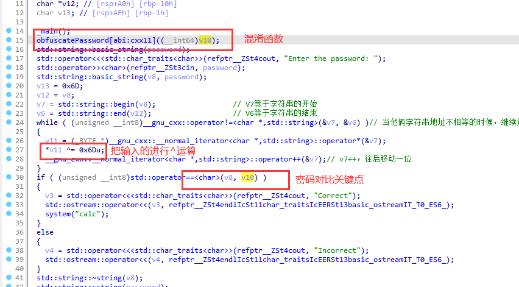
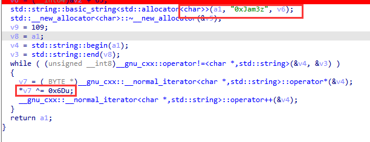
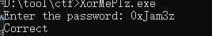

题目链接：<https://crackmes.one/crackme/663556466b8bd8ddfe33c386>

解题时间：20240709 0:44

这个题目关键是理清逻辑

这个题是C++编写的，一开始看这些内容，看起来很乱，绕不过来

之后习惯就好

整个代码的流程如下，其把输入的与 ^0x6D进行运算

关键就是这个 `obfuscatePassword[abi:cxx11]` 函数

点进去，一看，其也进行 `^0x6D` 进行运算

那答案不言而喻了，就是其明文 `(a1, "0xJam3z", v6);`

输入进去，OK，这个很简单

这题难度不大，但是初看C++的内容，比较绕

耐心做下去，会有提升的！！