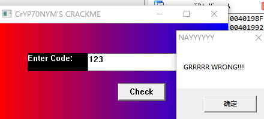
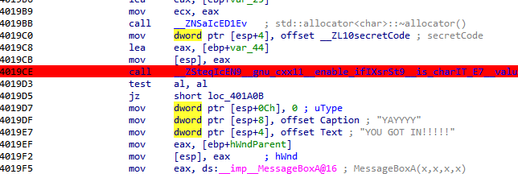
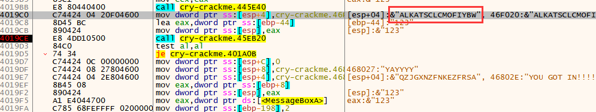
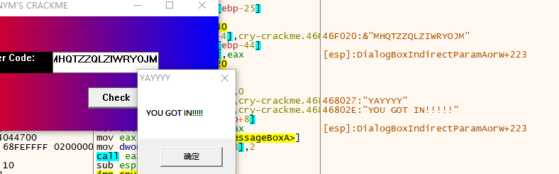
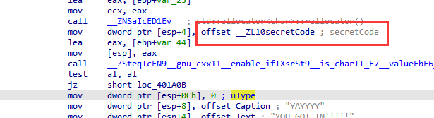
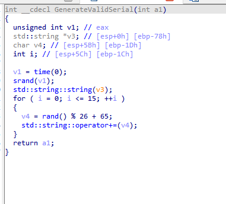

题目链接：<https://crackmes.one/crackme/6666e2d9e7b35c09bb266af2>

解题时间：20240709 1:04

打开题目，是一个简单的GUI

这种直接IDA查找字符串

点进去，找一下判断逻辑

用xdbg追一下

可以看到代码未加密，easy

但是每次密码都会改变！！！！

我们看看其密码是什么，追一下

如下，这个函数，很容易追出来

其算法逻辑如下

