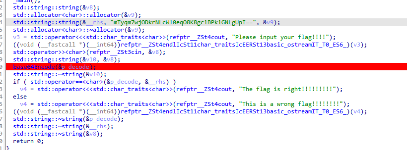
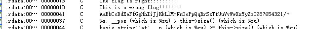

题目链接：<https://buuoj.cn/challenges#%E7%89%B9%E6%AE%8A%E7%9A%84%20BASE64>

解题时间：20240709 1:42

很典型的base64题目



直接找到base64码表



使用python对base64进行解码

```python 
import base64
import string
str1 = "mTyqm7wjODkrNLcWl0eqO8K8gc1BPk1GNLgUpI=="
# .rdata:0000000000489090	00000041	C	AaBbCcDdEeFfGgHhIiJjKkLlMmNnOoPpQqRrSsTtUuVvWwXxYyZz0987654321/+
string1 = "AaBbCcDdEeFfGgHhIiJjKkLlMmNnOoPpQqRrSsTtUuVvWwXxYyZz0987654321/+"
string2 = "ABCDEFGHIJKLMNOPQRSTUVWXYZabcdefghijklmnopqrstuvwxyz0123456789+/"
print(base64.b64decode(str1.translate(str.maketrans(string1, string2))))
```

最后结果是 `b'flag{Special_Base64_By_Lich}'`

很简单的一道题，不做过多赘述！
